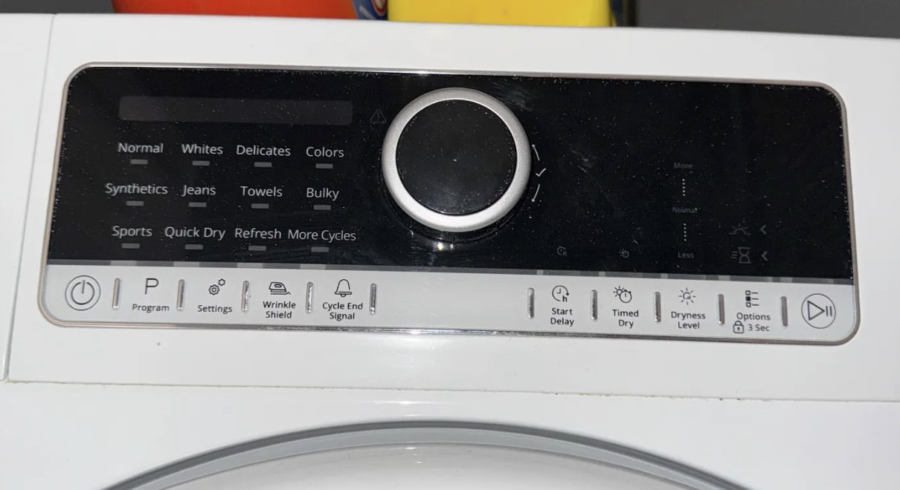
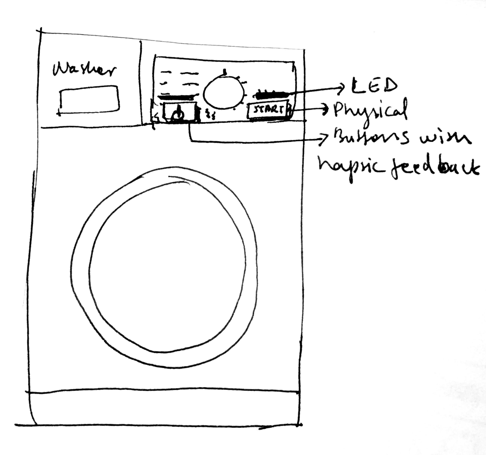
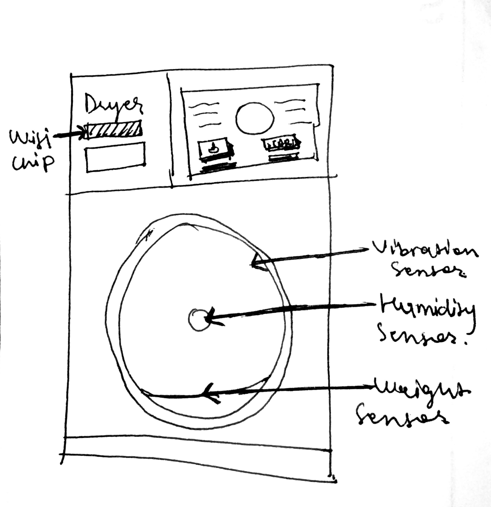

# Washer/Dryer Redesign

## Object Description and Methodology

I chose the washer and dryer in my apartment because it is one of the most frequently used objects in my daily life and also one of the most frustrating. Even though it is in-unit and technically convenient, it creates a lot of uncertainty and stress.

Both the washer and dryer use touch panel controls instead of physical buttons. The panels are unreliable. Sometimes they respond, and sometimes they do not, even when my hands are dry and I touch the same way. Starting laundry often feels unpredictable because I do not know if the machine understood what I did.

I also notice other issues like loud screeching sounds and strange mechanical behavior, but I am focusing on interaction and experience problems rather than physical repair for this assignment.

This critique is based on personal use, moments of failure, and patterns I have noticed over time.

## Object Analysis and Missing Affordances

### 1. Awareness and Feedback Gap

<b> Use Scenario: </b>
I touch "On" and then "Start." Sometimes the machine plays a sound, lights up, clicks the latch, and shows the time remaining. Other times, there is no visible or audible change.

<b> The Gap: </b>
The machine only communicates clearly when things go right. When they go wrong, it stays silent. It does not tell me whether my touch was not detected, the system is frozen, the machine is not ready, or something failed internally. When nothing happens, I cannot tell what went wrong.

<b> Opportunity: </b>
The machine could show a message like "Touch not detected" or "Try again," light up or play a short sound when any touch is registered, and use different sounds or messages for errors versus success.

<b> Justification: </b>
Clear feedback would turn guessing into understanding. It would save time and reduce frustration every time the screen fails to respond.

### 2. Adaptation Gap

<b> Use Scenario: </b>
Different people use the same machine. Sometimes I tap lightly, sometimes more firmly, sometimes quickly.

<b> The Gap: </b>
The touch panel expects one specific kind of touch and does not adjust when real people interact differently.

<b> Opportunity: </b>
The machine could learn typical touch pressure and speed over time, adjust sensitivity based on real usage, and include a physical "Start" button as a reliable backup.

<b> Justification: </b>
An everyday appliance should adapt to human behavior instead of forcing people to adapt to it.

### 3. Anticipation Gap

<b> Use Scenario: </b>
When I start the dryer, it might say "1 hour 30 minutes," which feels reasonable. But sometimes, hours later, it still says "10 minutes left." I have had cycles run three to four hours longer than the original estimate. Other times, the machine stops in the middle of a cycle. The timer stays frozen on the screen, but the drum is no longer moving.

<b> The Gap: </b>
The machine does not recognize when its behavior becomes abnormal. It does not notice when a cycle is running far longer than expected, when the timer is stuck while the machine is inactive, or when clothes are likely already dry.

<b> Opportunity: </b>
The machine could detect when real cycle time is far outside the expected range, detect when the timer is not changing while the drum is not moving, send a phone notification like "Your dryer has stopped unexpectedly" or "Your dryer is running much longer than usual," and automatically pause or shut off when something seems wrong.

<b> Justification: </b>
Unpredictable cycles make the machine hard to trust. I now only do laundry when I know I will be home all day because I worry about damage to my clothes or safety issues.

### 4. Social Fit Gap
<b> Use Scenario: </b>
I plan my entire day around laundry because I do not trust the machine to work predictably.

<b> The Gap: </b>
Instead of fitting into my life, the machine forces me to babysit it. I cannot leave the apartment during a cycle because I might come back to wet clothes sitting for hours, or clothes that have been tumbling for five hours. I have to be present to restart it when it fails or catch it before it over-runs.

<b> Opportunity: </b>
The machine could send remote notifications when cycles complete or fail, provide reliable starting so I know it actually began, and behave predictably so I can trust the time estimates.

<b> Justification: </b>
An everyday object should fade into the background. This one controls my schedule. Laundry should not dictate whether I can run errands, go to class, or leave my home.

## Proposed Redesign

I am addressing four critical gaps: feedback (the machine must communicate what it understood), adaptation (controls should work reliably for different users), anticipation (the machine should detect abnormal behavior), and social fit (the machine should fit into my life instead of controlling it).

I chose not to redesign mechanical issues like noise or internal hardware failure because those require physical repair rather than interaction or changes.

### Proposed Features

<b> Hybrid Control System: </b>

Replace the most critical controls (Power and Start) with physical push buttons while keeping touch controls for cycle selection. Add a small vibration motor for haptic feedback and LEDs around each button for visual confirmation.

<b> Status Monitoring and Alerts: </b>

Add a motion or vibration sensor to detect if the drum is actually spinning, a WiFi chip to send notifications to phone via text, and logic to compare the timer with real activity. If the timer says 30 minutes left but the drum stopped, send an alert. If the cycle runs far longer than originally estimated, send an alert.

Why this needs ML: The system should learn what normal variation looks like. A heavy towel load might take longer, but five hours for a small load is not normal. An anomaly detection model could learn these patterns over time and reduce false alarms. From research, this could be something like a basic decision tree or anomaly detection model.

<b> Actual Dryness Detection (Dryer Only) </b>

Add a humidity sensor inside the drum and a weight sensor to estimate load size. The dryer measures moisture in real time and ends the cycle when clothes reach an appropriate dryness level.

Why ML instead of a single threshold: Different fabrics reach "dry" at different moisture levels. One fixed threshold would over-dry delicates or under-dry towels. An ML model could learn from behavior like restarting cycles or adding time to improve predictions based on load weight, fabric type, and moisture readings.

### Social Considerations
This redesign does not change how people do laundry. It makes the process more trustworthy.

Right now, I plan my day around laundry because I cannot trust the machine. With reliable input, clear feedback, and alerts, I could leave my apartment without worrying. Physical buttons feel familiar and normal. Notifications are private and low-effort. The system fits into everyday life instead of controlling it.

### Tradeoff Analysis

<b> New Failure Modes: </b>
WiFi could fail. Sensors could break. Buttons wear out. ML predictions may be wrong early on.

<b> Costs: </b>
Adds around $50 to $100 in hardware.

<b> Added Complexity: </b>
More components, software, and data.

<b> Why It Is Worth It: </b>
The current machine already uses complex technology that does not work reliably. This redesign fixes broken complexity instead of adding unnecessary complexity. It restores basic trust: when I press Start, I know it started, and if something goes wrong, I will know.